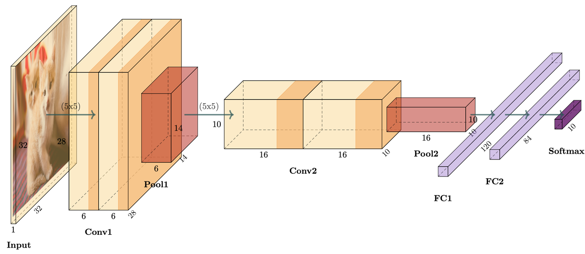

# LeNet

[toc]

## 1 Paper

> * 论文摘要：https://blog.51cto.com/u_15178976/2790849
> * 论文翻译(部分)：https://blog.csdn.net/qq_34288751/article/details/113575650
> * 李沐：https://zh-v2.d2l.ai/chapter_convolutional-neural-networks/lenet.html
> * 论文从第四部分开始没有精度，以后有空再读。

* 第一部分：概念介绍
  * 从数据中学习：此时还没有“训练-验证-测试”的约定俗成，作者讨论了在训练集上训练完并不能算成最好，实际中的错例更重要。
  * 基于梯度的学习：其实就是剃度下降的意思。
  * 梯度反向传播：早期反向传播还没有形成共识，作者强调了一下本文用的反向传播。
  * 在实际手写识别系统中学习：从孤立字符到连续的词，后边详细展开。
  * 全局训练系统：提出“整个系统被构建为一个由可微模块组成的前馈网络”
* 第二部分：手写字符识别的任务（用于孤立字符识别的卷积神经网络）
  * 卷积网络(CNN)更优秀，提出 LeNet5(这部分去看看原文很有趣，作者在努力的打开黑箱子)
    * CNN 有位移不变性，没有结构的网络不能做到。
    * CNN 可以保存拓扑结构，全连接的网络不能做到。
    
  * Lenet5 更多细节
    * 输入像素值被归一化了，这样背景(白色)对应-0.1，前景(黑色)对应1.175.这使得输入的均值约等于0，方差约等于1
    * C3中每个特征图与S2中部分特征图相连（竟然不是全部相连）
      
  * 损失函数：交叉熵
* 第三部分：在 MNIST 上比较几种学习技术的性能
  * MNIST：从NIST改进而来（MNIST=Modifed NIST set）
  * Linear Classier and Pairwise Linear Classier(线性分类器和成对线性分类器线性分类器和成对线性分类器)
  * Baseline Nearest Neighbor Classier(基线最近邻分类器)
  * Principal Component Analysis PCA and Polynomial Classier
  * Radial Basis Function Network
  * Tangent Distance Classier TDC
  * Support Vector Machine SVM
  * One Hidden Layer Fully Connected Multilayer Neural Network(单层隐节点)
  * Two Hidden Layer Fully Connected Multilayer Neural Network(双层隐节点)
  * LeNet-1
  * LeNet-4
  * Boosted LeNet-4
  * LeNet-5
  * 最终的结论是 LeNet 从性能和指标上都领先。
  
* 第四部分：为了从识别单个字符到识别文档中的单词和句子，组合多个经过训练以减少总体错误的模块，提出可训练图变换网络(GTN)的概念
* 第五部分：用于识别单词或其他字符串的启发式过分分割的经典方法。
* 第六部分：基于辨别性和非辨别性梯度的技术，可在单词级别上训练识别器，而无需人工分段和标记。
* 第七部分：介绍了有前景的空间位移神经网络方法，该方法通过在输入的所有可能位置上扫描识别器，从而避免了对分割启发式算法的需求。
* 第八部分：表明了可训练图变换网络可以基于通用的图形组合算法表述为多个通用的转换。本文还研究了语音识别中常用的GTN和隐马尔可夫模型之间的联系。
* 第九部分：介绍了经过全局训练的GTN系统用于识别在笔输入计算机中输入的笔迹。这个问题被称为“在线”手写识别，因为机器必须在用户书写时立即反馈结果。系统的核心是卷积神经网络。结果清楚地证明了在单词级别训练识别器的优势，而不是对它进行预先分割的，手工标记的，孤立的字符进行训练。
* 第十部分：描述了一个完整的基于GTN的系统，用于读取手写和机器打印的银行支票，该系统的核心是第二部分中描述的称为LeNet-5的卷积神经网络。该系统已在NCR公司的银行业支票识别系统中投入商业使用，每月在全美国多家银行中读取数百万张支票。


## 2 Project



### 2.1. Overview

* 项目简介
    * 这是一个基于 Pytorch2 的 LeNet 复现，并在 MNIST 数据集上进行训练与测试。
    * 该项目可以自动选择 CPU 或 GPU，尽量提高速度。
    * 该项目借用我自己写的深度学习基础框架 clib。
* 实现细节
    * 采用了 SGD，发现比 Adam 效果好一点。
    * 每个 epoch 保存一个 checkpoint。
    * 原本的 LeNet 使用的是平均池化层和 softmax 激活函数，可以通过 train.sh 和 test.sh 更改模型使用最大池化层和 ReLU 激活函数。
    * 采用了 Holdout 进行训练。
    * 采用了 ReduceLROnPlateau 调整学习率。
    * 采用了 tensorboard 记录训练过程。
    * 训练和推理均固定了随机种子，在 CPU 和 GPU 上代码均有可复现性。

### 2.2. Roadmap

1. `check_path.sh`：配置存放训练好的模型与下载的数据集的文件夹。这个脚本会根据你提供的 path 列表，按顺序找到第一个存在的路径。（为什么要写一个列表而不是一个路径呢，主要是为了适配本地与远程同时开发。）
    ```bash
    #!/bin/bash

    # 定义要检查的路径数组
    paths=( # 请修改成你的 paths 列表
        '/root/autodl-fs/DateSets'
        '/Volumes/Charles/DateSets'
        '/Users/kimshan/resources/DataSets'
        '/home/vision/sht/DataSets'
    )

    # 遍历路径数组
    for path in "${paths[@]}"; do
        # 检查路径是否存在
        if [ -d "$path" ]; then
            echo "$path"
            exit 0
        fi
    done
    exit 1
    ```
2. DataSets 文件夹内部目录组织结构：其中需要一个 Model 文件夹，用来存放训练出来的模型。其他的文件夹可以自由命名，比如可以创建一个 torchvision 文件夹，用来存放 torchvision 自动下载的数据集。
    ```bash
    kimshan@MacBook-Pro-2 DateSets % ls
    Model		torchvision
    kimshan@MacBook-Pro-2 DateSets % cd torchvision 
    kimshan@MacBook-Pro-2 torchvision % ls
    EMNIST		KMNIST		QMNIST		flowers-17
    FashionMNIST	MNIST		flowers-102
    kimshan@MacBook-Pro-2 torchvision % cd ../Model 
    kimshan@MacBook-Pro-2 Model % ls
    AUIF		DIDFuse		FusionGAN	RCNN		UNFusion
    CDDFuse		DIVFusion	GAN		Res2Fusion
    CoCoNet		DeepFuse	LeNet		SRCNN
    DDFM		DenseFuse	MFEIF		SwinFuse
    ```
3. 为 shell 脚本加权限
    ```bash
    kimshan@MacBook-Pro-2 LeNet % chmod 777 ./check_path.sh 
    kimshan@MacBook-Pro-2 LeNet % chmod 777 ./test.sh      
    kimshan@MacBook-Pro-2 LeNet % chmod 777 ./train.sh
    ```
4. `train.sh`：训练。你可以更改 train.sh 里边的参数，比如调整初始学习率等等。
    ```bash
    (Pytorch2) kimshan@MacBook-Pro-2 LeNet % ./train.sh
    [ LeNet ] ========== Parameters ==========
    [ LeNet ]            name : LeNet
    [ LeNet ]         comment : LeNet on MNIST with ReduceLROnPlateau on SGD
    [ LeNet ]          device : cpu
    [ LeNet ] model_base_path : /Users/kimshan/resources/DataSets/Model/LeNet/MNIST/2024_10_31_10_22
    [ LeNet ]    dataset_path : /Users/kimshan/resources/DataSets/torchvision
    [ LeNet ]     num_classes : 10
    [ LeNet ]        use_relu : False
    [ LeNet ]    use_max_pool : False
    [ LeNet ]            seed : 32
    [ LeNet ]      batch_size : 32
    [ LeNet ]       optimizer : SGD
    [ LeNet ]              lr : 0.3
    [ LeNet ]    lr_scheduler : ReduceLROnPlateau
    [ LeNet ]       max_epoch : 100
    [ LeNet ]      max_reduce : 3
    [ LeNet ]          factor : 0.1
    [ LeNet ]      train_mode : Holdout
    [ LeNet ]             val : 0.2
    [ LeNet ] ===============================
    Epoch [1/100]: 100%|█████| 1500/1500 [00:17<00:00, 85.57it/s, loss=0.184]
    Epoch [1/100] Train Loss: 0.0058, Train Accuracy: 0.9431
    Epoch [1/100] Val Loss: 0.0034, Val Accuracy: 0.9661
    Epoch [2/100]: 100%|█████| 1500/1500 [00:20<00:00, 71.46it/s, loss=0.0737]
    Epoch [2/100] Train Loss: 0.0023, Train Accuracy: 0.9766
    ...
    Epoch [18/100]: 100%|█████| 1500/1500 [00:18<00:00, 79.52it/s, loss=0.00286]
    Epoch [18/100] Train Loss: 0.0001, Train Accuracy: 0.9996
    Epoch [18/100] Val Loss: 0.0014, Val Accuracy: 0.9882
    Epoch [19/100]: 100%|█████| 1500/1500 [00:16<00:00, 88.56it/s, loss=0.00284]
    Epoch [19/100] Train Loss: 0.0001, Train Accuracy: 0.9997
    Epoch [19/100] Val Loss: 0.0014, Val Accuracy: 0.9882
    Training has converged. Stopping...
    Accuracy of the model on the 10000 test images: 99.02%
    ```

    训练完会生成以下内容

    ```
    kimshan@MacBook-Pro-2 2024_10_31_10_22 % pwd
    /Users/kimshan/resources/DataSets/Model/LeNet/MNIST/2024_10_31_10_22
    kimshan@MacBook-Pro-2 2024_10_31_10_22 % tree
    .
    ├── checkpoints
    │   ├── 1.pt
    |     ...
    │   ├── 18.pt
    │   ├── 19.pt

    ├── config.json
    └── events.out.tfevents.1730341370.MacBook-Pro-2.local.85732.0

    2 directories, 21 files
    ```

5. `test.sh`：测试。请配置要加载的pt文件名称，然后调用脚本。比如这是第三个 epoch 的结果。
    ```bash
    (Pytorch2) kimshan@MacBook-Pro-2 LeNet % ./test.sh 
    [ LeNet ] ========== Parameters ==========
    [ LeNet ]            name : LeNet
    [ LeNet ]         comment : LeNET on MNNIST
    [ LeNet ]          device : cpu
    [ LeNet ]      model_path : /Users/kimshan/resources/DataSets/Model/LeNet/MNIST/2024_10_31_10_22/checkpoints/3.pt
    [ LeNet ]    dataset_path : /Users/kimshan/resources/DataSets/torchvision
    [ LeNet ]     num_classes : 10
    [ LeNet ]        use_relu : False
    [ LeNet ]    use_max_pool : False
    [ LeNet ]      batch_size : 32
    [ LeNet ] ===============================
    100%|█████████████████████████████████████████| 313/313 [00:03<00:00, 96.62it/s]
    Accuracy of the model on the 313 test images: 98.31%
    ```

    这是第 18 个 epoch 的结果
    
    ```bash
    (Pytorch2) kimshan@MacBook-Pro-2 LeNet % ./test.sh
    [ LeNet ] ========== Parameters ==========
    [ LeNet ]            name : LeNet
    [ LeNet ]         comment : LeNET on MNNIST
    [ LeNet ]          device : cpu
    [ LeNet ]      model_path : /Users/kimshan/resources/DataSets/Model/LeNet/MNIST/2024_10_31_10_22/checkpoints/18.pt
    [ LeNet ]    dataset_path : /Users/kimshan/resources/DataSets/torchvision
    [ LeNet ]     num_classes : 10
    [ LeNet ]        use_relu : False
    [ LeNet ]    use_max_pool : False
    [ LeNet ]      batch_size : 32
    [ LeNet ] ===============================
    100%|████████████████████████████████████████| 313/313 [00:02<00:00, 132.06it/s]
    Accuracy of the model on the 313 test images: 99.03%
    ```

6. tensorboard 查看训练过程
    ```bash
    (Pytorch2) kimshan@MacBook-Pro-2 2024_10_31_10_22 % pwd
    /Users/kimshan/resources/DataSets/Model/LeNet/MNIST/2024_10_31_10_22
    (Pytorch2) kimshan@MacBook-Pro-2 2024_10_31_10_22 % tensorboard --logdir .
    ```

    